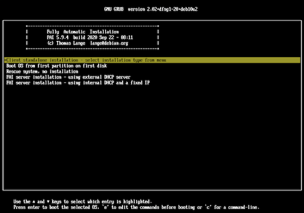
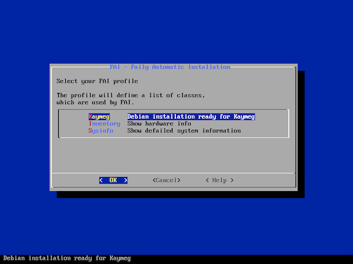
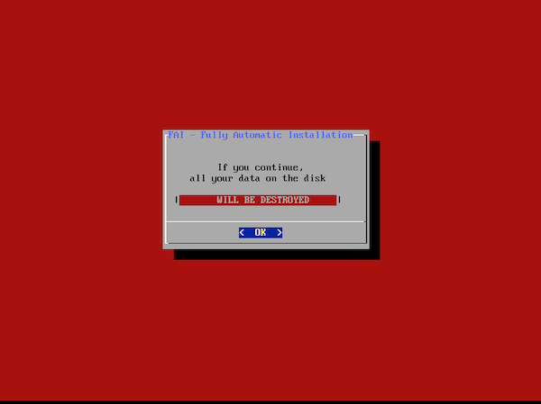

  

# kaymeg <!-- omit in toc -->

- [Goals](#goals)
- [Components](#components)
- [Prerequisites](#prerequisites)
- [Warning](#warning)
- [The Guide](#the-guide)
  - [Step 1: Base Operating System (Debian) install](#step-1-base-operating-system-debian-install)
    - [Decide how you will address & name your nodes](#decide-how-you-will-address--name-your-nodes)
    - [Install Debian](#install-debian)
    - [Post-install setup](#post-install-setup)
  - [Step 2: Run `install.sh` script](#step-2-run-installsh-script)
    - [Clone this repo](#clone-this-repo)
  - [Step 3: Use k8s!](#step-3-use-k8s)
- [Usage `install.sh`](#usage-installsh)
- [Rebuilding a failed node](#rebuilding-a-failed-node)
- [How to build the Debian FAI CD](#how-to-build-the-debian-fai-cd)
- [Limitations](#limitations)
  - [Load Balancer](#load-balancer)
- [Known Issues](#known-issues)
- [Contributing](#contributing)
- [License](#license)
- [Contact](#contact)
- [Acknowledgements](#acknowledgements)

**kaymeg** is a set of scripts that combines [k3s](https://k3s.io) (**kay**), [Metal LB](https://metallb.universe.tf) (**m**), [etcd](https://etcd.io) (**e**) and [GlusterFS](https://www.gluster.org) (**g**) to form a simple, lightweight, cheap to build & run, bare metal, high availability Kubernetes cluster.

Most of the installation and configuration is automated, allowing for fast & repeatable provisioning in cloud and bare metal environments.

## Goals

- Run on minimum specificiation hardware / cloud resources
- Run on a minimum of three nodes
- High availability (without the need for a dedicated load balancer)

## Components

- ✅ Debian 10.4
- ✅ k3s (compiled with GlusterFS support, leveraging [k3s-glusterfs](https://github.com/cjrpriest/k3s-glusterfs))
- ✅ External etcd (should not be needed once k3s is certified with embedded etcd support)
- ✅ GlusterFS
  - ✅ NFS access to GlusterFS volumes (via Ganesha)
- ✅ Kubernetes Dashboard
- ✅ MetalLB

## Prerequisites

- Three available nodes (VMs or bare metal)
  - each node to have two disks: <code>/dev/sda</code> for the OS and programs, <code>/dev/sdb</code> for data
- Debian netinst installation media
- An internet connection

## Warning

⚠️ This setup is not intended for public production use. However, it should be suitable for private production use, or for development / test purposes

## The Guide

There are three steps to getting up and running:
1. Base Operating System (Debian) install _(this is the hardest bit!)_
1. Run `install.sh` script
1. Use k8s!

That's it!

### Step 1: Base Operating System (Debian) install

Each node is based on a minimal install of Debian. If you are in a virtual or cloud environment then you may wish to consider snapshotting your node at the end of this step, in order to facilitate rapid testing cycles.

#### Decide how you will address & name your nodes

There are several options available to you, for example DHCP, or static (the details of which are outside the scope of this document).

Whichever way you choose to go, you must end up with:
- An IP address for each node that does not change (not necessarily _static_, it can still be issued dynamically)
- A DNS resolvable name

It might make sense to select some names and addresses that are easy to remember, such as `10.8.8.1`, `10.8.8.2`, `10.8.8.3`, and `k8s-server1`, `k8s-server2`, `k8s-server3`.

#### Install Debian

Follow these steps to setup a base installation of Debian.

_Note: this procedure assumes that you will set hostname and IP address via DHCP_

1. Download [fai-kaymeg.iso](https://github.com/cjrpriest/kaymeg/releases/download/v1/fai-kaymeg.iso), and burn this to a USB drive, or CD.
   1. This is built using a [fai config customised for kaymeg](https://github.com/cjrpriest/kaymeg-fai-config)
1. Boot the machine from the ISO, and select `Client standalone installation` 

1. Select Kaymeg from the FAI profile menu 

1. Confirm you are ok with disks being erased 

1. Wait for installation to complete, and confirm to reboot

The default root password is `k8s` -- make sure this is changed as soon as possible.
  
#### Post-install setup

After Debian has booted for the first time, run the following command to export your public key to the instance:

``ssh root@<server-nanme> "mkdir ~/.ssh && echo `cat ~/.ssh/id_rsa.pub` > ~/.ssh/authorized_keys"``

At this stage, if you are using virtualised infrastructure, you probably want to shutdown your instance and take a snapshot, as from here things are more automated 

### Step 2: Run `install.sh` script

#### Clone this repo

1. Clone this repo: `git clone https://github.com/cjrpriest/k3s-etcd-glusterfs-metallb`
1. Execute `install.sh` (see below for usage)

### Step 3: Use k8s!

That's it, you're done!

## Usage `install.sh`

`install.sh SERVER1_DETAILS SERVER2_DETAILS SERVER3_DETAILS LB_RANGE_START LB_RANGE_END`

| Argument | Description | Example
|--|--|--|
|`SERVER1_DETAILS`| DNS name and IP address of 1st server, in the format `dns_name:ip_address`| `k8s-server1:10.8.8.1`|
|`SERVER2_DETAILS`| DNS name and IP address of 1st server, in the format `dns_name:ip_address`| `k8s-server2:10.8.8.2`|
|`SERVER3_DETAILS`| DNS name and IP address of 1st server, in the format `dns_name:ip_address`| `k8s-server3:10.8.8.3`|
|`LB_RANGE_START`| The first IP address in the range available for the load balancer to use | `10.8.8.10`|
|`LB_RANGE_END`| The last IP address in the range available for the load balancer to use | `10.8.8.20`|

Example Usage: 
`./install.sh k8s-server1:10.8.8.1 k8s-server2:10.8.8.2 k8s-server3:10.8.8.3 10.8.8.10 10.8.8.20`

## Rebuilding a failed node

What if one of the nodes has failed, and it is unrecoverable?

This procedure assumes that you wish to (re)build a node with the same name & IP address etc. There is no requirement that the node is rebuilt on the same hardware.

1. Remove the failed node from the gluster cluster. From a working node, execute:
   1. `gluster volume info` to verify that there are three recognised bricks in the cluster
   1. `gluster volume remove-brick gv0 replica 2 <failed-node-name>:/data/brick1/gv0 force` to remove the failed node's brick from the cluster
   1. `gluster volume info` to verify that there are now two recognised bricks in the cluster
   1. `gluster peer status` to verify that the failed node is recognised as `Disconnected`
   1. `gluster peer detach <failed-node-name>` to detach the failed node from the gluster cluster
   1. `gluster peer status` to verify that the failed node is no longer present
2. Install base operating system (see [Install Debian](#install-debian) & [Post-install setup](#post-install-setup)) on the failed node
3. Run the install script with an additional parameter, which instructs it to only setup and configure that node:  `./install.sh k8s-server1:10.8.8.1 k8s-server2:10.8.8.2 k8s-server3:10.8.8.3 10.8.8.10 10.8.8.20 <failed-node-name>`
4. Re-join the (now rebuilt) node to the gluster cluster. From a (previously) working node, execute:
   1. `gluster peer probe <failed-node-name>` to re-attach the node the cluster
   1. `gluster peer status` to verify that the failed node is recognised as `Connected`
   1. `gluster volume add-brick gv0 replica 3 k8s-server2:/data/brick1/gv0` to re-add the rebuilt node's brick to the cluster
   1. `gluster volume info` to verify that there are now three recognised bricks in the cluster
5. Remove the failed node from etcd. From a (previously) working node, execute:
   1. `etcdctl -C http://<this-nodes-ip-address>:2379 cluster-health` to determine the member id if the failed node
   2. `etcdctl -C http://<this-nodes-ip-address>:2379 member remove <id-of-failed-node>`
   3. `etcdctl -C http://<this-nodes-ip-address>:2379 member add <failed-node-name> http://<failed-node-ip-address>:2380`
6. On the failed node, execute:
   1. Replace `# ETCD_INITIAL_CLUSTER_STATE="new"` with `ETCD_INITIAL_CLUSTER_STATE="existing"` in `/etc/default/etcd` such that the node knows that it should rejoin the existing cluster
   2. `systemctl restart etcd` to restart etcd
7. From a (previously) working node, execute `etcdctl -C http://<this-nodes-ip-address>:2379 cluster-health` to verify that the cluster is in good health

## How to build the Debian FAI CD

In a Debian based linux distro:

1. `wget -O - https://fai-project.org/download/2BF8D9FE074BCDE4.asc | apt-key add -` to add the FAI project public key to your instance of apt
1. `echo "deb http://fai-project.org/download buster koeln" > /etc/apt/sources.list.d/fai.list` to add the FAI project source
1. `apt-get update` to update apt
1. `aptitude install fai-quickstart` to install the minimum FAI project binaries
1. `fai-mk-configspace` to create the default configuration
1. `fai-make-nfsroot` to create the default NFS root data
1. `rm -Rf /srv/fai/config` to delete the example config files
1. `git clone https://github.com/cjrpriest/kaymeg-fai-config /srv/fai/config/` to add the Kaymeg config
1. `fai-cd -C /etc/fai -M fai.iso` to build the ISO

## Limitations

### Load Balancer

As we cannot replicate a true external load balancer, then there are some limitations. Notably, they are:
- **Slow / broken failover**: MetalLB relies on clients to change the MAC address that they are sending traffic to, once a failure occurs. This isn't completely bug free, but should be fine in modern OSes and devices
- **Single node bottlenecking**: Clients will always send all traffic for a service to one node, and MetalLB distributes this internally within the cluster. This could (theoretically) result in a network bottleneck. However, unless your use case involves each node processing data that is more than a third of the networking capacity of a single node (unlikely), then you are probably going to be ok.

These limitations are described in more detail [over in the MetalLB documentation](https://metallb.universe.tf/concepts/layer2/)

## Known Issues

- When a node is rebuilt (according the above procedure) NFS doesn't appear to work. A reboot of the node fixes this. 

## Contributing

Contributions are what make the open source community such an amazing place to be learn, inspire, and create. Any contributions you make are **greatly appreciated**.

1. Fork the Project
2. Create your Feature Branch (`git checkout -b feature/AmazingFeature`)
3. Commit your Changes (`git commit -m 'Add some AmazingFeature'`)
4. Push to the Branch (`git push origin feature/AmazingFeature`)
5. Open a Pull Request

## License

Distributed under the MIT License. See `LICENSE` for more information.

## Contact

Chris Priest - [@cjrpriest](https://twitter.com/cjrpriest)
Project Link: [https://github.com/cjrpriest/kaymeg](https://github.com/cjrpriest/kaymeg)

## Acknowledgements

- [k3s](https://k3s.io)
- [GlusterFS](https://www.gluster.org)
- [etcd](https://etcd.io)
- [MetalLB](https://metallb.universe.tf)
- [Choose an Open Source License](https://choosealicense.com)
